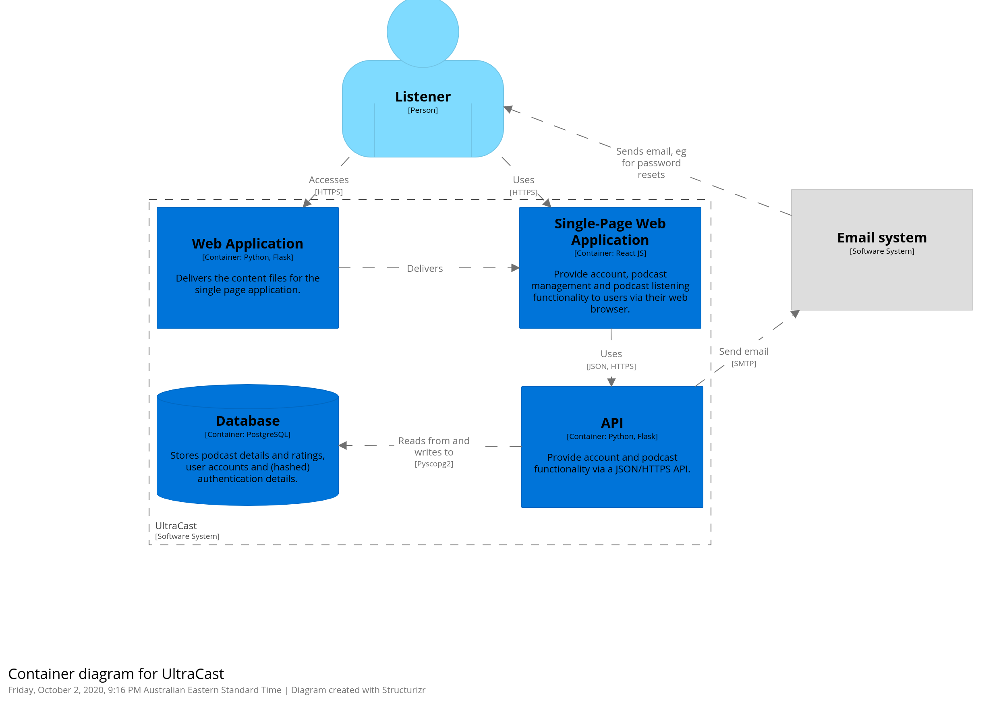

# Ultracast
## COMP3900-H13A-BroJogan 
### Justin Mack (z5160822), Pawanjot Singh (zXXXXXXX), Michael Corbin (z5206453), Nicholas Bang (z5162078), Tom Bowden (z5161185)

### Roles
Scrum Master: Nicholas  
Developers: Justin, Pawanjot, Michael, Tom 

### Table of Contents
1...XXXX  
2...XXXX

### Submission Date
dd/mm/yyyy

---------------------

## Background

### Problem Being Solved

Listening to podcasts is popular with many people. We aim to make listening to podcasts easier for people who wish to use their desktop or laptop computers for listening to podcasts.  
Many solutions for listening to podcasts exist, notably Spotify, Pocketcasts, the ABC Listen App, Google Podcasts, and Soundcloud. Each of these have a number of strength as well as drawbacks.  
Many of the podcast solutions require users to sign up to their platform before users can listen to podcasts. We aim to allow users to be able to access their podcasts without having to sign in, however we also aim to offer account functionality so the user's place in podcasts and tastes in podcasts can be tracked.  
We also aim to offer users the ability to access podcasts on a web app, since many of the other solutions listed below are for mobile only, or focus more on mobile.  
Since podcasts are almost universally distributed through RSS feeds hosted on various platforms on the internet, we will use these RSS feeds to allow listeners to enjoy podcasts from many sources. In addition this will allow us to easily let listeners or podcast creators add RSS feeds to our platform if it isn't already on the platform.
Finally we aim to provide users with all of the information available about the podcasts they listen to such as descriptions, authors, and show notes.

### Spotify
Spotify is available primarily as a phone app, as well as a desktop applications, and a web app. It requires users sign up to the app, and offers podcasts as a secondary feature to its core use; music. (Spotify)

#### Drawbacks

* Spotify requires users to sign up
* Spotify shows ads to non-premium users (users who do not pay for the service)
* Spotify does not support show notes
* Spotify's download system is proprietry meaning users have to use their app to listen to their downloaded podcasts
* On the desktop and web apps, users cannot download podcasts

### Pocketcasts
Pocketcasts is primarily a phone app that is dedicated to podcasts. (Pocketcasts)

#### Drawbacks

* Pocketcasts requires users to sign up before they can access the platform
* Pocketcasts restricts use of their web app to paying customers

### ABC Listen App
The ABC Listen App is a mobile app that allows users to listen to ABC produced radio shows and podcasts. (ABC)

#### Drawbacks

* The ABC Listen app only provides access to ABC radio programs and podcasts
* The ABC listen app is mobile only and does not allow desktop users to access their service

### Google Podcasts

Google Podcasts is a web app and mobile app that is dedicated to podcasts. (Google)

#### Drawbacks

* Google Podcasts does not allow access to the show notes of each episode
* The Google Podcasts web app does not allow users to download episodes

### Soundcloud

Soundcloud is a web and mobile application designed for listening to music. It does not require users to sign up. (Soundcloud)

#### Drawbacks

* Soundcloud has very spotty coverage of podcast apps, and does not support RSS feeds which are the standard for distributing podcasts

---------------------

## User Stories & Sprints

### User stories

### Sprint timeline
| Sprint # / Event |  Week | Dates                   |
|------------------|-------|-------------------------|
| 1                | 3-5   | Thu Oct 1 - Wed Oct 14  | 
| Demo             | 5     | Thu Oct 15              |
| 2                | 5-7   | Thu Oct 15 - Wed Oct 28 |
| Retrospective    | 7     | Thu Oct 29              |
| 3                | 7-9   | Thu Oct 29 - Wed Nov 11 |
| Demo             | 8     | Thu Nov 5               |
| Retrospective    | 9     | Thu Nov 12              |
| Submission       | 10    | Mon Nov 16              |

### First sprint user stories
**Podcast searching:**  
CHB-14: As a listener, I want to be able to search for a podcast so that I can find the right podcast to listen to. (BASIC VERSION)  
CHB-19: As a listener, I want to be able to see the title of relevant podcasts and the number of subscribers so I can find the most popular podcast.  
CHB-23: As a listener, I want to be able to select a specific podcast from the list shown to view its full details so that I can decide if It's right for me.  

! These user stories would mean that login was implemented in the first sprint without actually being of any use to users, that might be bad?  
**User authorisation:**  
CHB-33: As a listener, I want to be able to log in so that I can access my account, and others cannot.  
CHB-34: As a listener, I want to be able to create an account so that my preferences and history can be stored for me.  
CHB-35: As a listener, I want to be able to log out so that other computer users can't access my account, and I can use the website as another user.  

**Podcast download:**  
CHB-20: As a listener, I want to be able to download podcasts for offline listening.  

#### Allocation

### Project objectives
> "Clearly communicates how all project objectives are satisfied by user stories that are defined." 

! I think this is implicit in the previous sections?

### Novel functionality
Given our analysis of existing services above, we highlight the following features as novel functionality:
- Ability to browse the entire website and access, play and download any podcast without an account
  * ! can this really be reflected as a user story?
- Display show notes during podcast play
  * ! add a user story for this?
- Ability to view user-submitted timestamps during podcast play
  * ! add a user story for this?
- Podcast episodes can be downloaded (including batch downloading) in MP3 form: CHB-36

---------------------

## Interface & Flow Diagrams

---------------------

## System Architecture

**Presentation layer:**   
The frontend code which creates the user interface in the user's web browser, by running in the end-user's browser. This code interacts with the backend APIs by sending requests such as search queries and requests for a particular podcast's details. The frontend code then interprets the data in these responses to decide on interface changes and display messages, formats the data to display within the interface, and plays the music if relevant. 
Our intention is for this to be a single-page web application. The web application is delivered by a Python/Flask server backend.
- Technologies: HTML, CSS, React JS.

**Business layer:**  
The business layer code runs on the server and implements a RESTful API. It receives requests from the frontend, communicates with the data layer to store data and retrieve results according to database rules, and returns results to the frontend in (probably) JSON format. In many cases, the business layer will return the RSS feed link for a podcast, and the presentation layer code will interpret this rss feed to find episode names and music files.
It also performs data layer and server maintenance independent of API requests.
- Technologies: Python with Flask, Psycopg

Overview of API plan:
| HTTP Method |  Endpoint                                                    | Request body | Action                  |
|-------------|--------------------------------------------------------------|--------------|-------------------------|
| GET         | `/podcasts/<podcastID>`                                      |              | Returns podcast details - RSS feed URL, rating |
| GET         | `/podcasts?q=<query>&offset=<startNum>&limit=<limitNum>`     |              | Search. Request `limitNum` results starting at result number `startNum` |
| POST        | `/podcasts`                                                  | `{"rss": <rsslink>}` | Add a podcast   |
| GET         | `/users/self/podcasts/<podcastID>/episodes/<episodeID>/time` |              | Return time progress in episode |
| PUT         | `/users/self/podcasts/<podcastID>/episodes/<episodeID>/time` | `{"time": <time>}` | Update time progress in episode, and also listening history |
| PUT         | `/users/self/podcasts/<podcastID>/rating`                    | `{"rating": <rating>}`              | Update rating for podcast |
| GET         | `/users/self/podcasts/<podcastID>`                           |              | Get user's podcast rating, whether subscribed |
| POST        | `/users`                                                     | `{"email": <email>, "username": <username>, "password": <password>}`              | Create account |
| DELETE      | `/users/self`                                                |              | Delete account |
| PUT         | `/users/self/password`                                       | `{"oldpassword": <oldpassword>, "newpassword": <newpassword>}`                                                                             | Change password  |
| PUT         | `/users/self/email`                                          | `{"password": <password>, "newemail": <email>}`                                                                                           | Change email address |
| POST        | `/users/passwordreset`                                       | `{"email": <emailaddress>}`                                                                                           | Request password reset |
| POST        | `/users/self/subscriptions`                                  | `{"id": <podcastID>}`           | Subscribe to a podcast |
| DELETE      | `/users/self/subscriptions/<podcastID>`                      |              | Unsubscribe from a podcast |
| GET         | `/users/self/subscriptions`                                  |              | Get list of subscribed podcasts - IDs and maybe the actual podcast info as well, to save an RTT from follow up requests? |
| GET         | `/users/self/rejectedrecommendations`                        |              | Get list of rejected podcast recommendations |
| POST        | `/users/self/rejectedrecommendations`                        | `{"id": <podcastID>}` | Add rejected recommendation |
| GET         | `/users/self/history?offset=<startNum>&limit=<limitNum>&podcast=<podcastID>`     |              | Get listening history. With podcast set, returns listening history for a particular podcast. |

**Data layer:**  
The data layer contains the database and its communication services. It stores the data and provides services for storing and retrieving data. It sits on a server, in our case likely the same server as the business layer.
- Technologies: PostgreSQL

### External actors / user types
- Listeners: Listeners want to find, browse, discover, listen to, download and rate podcasts. Subscriptions make it easier for them to keep track of their podcasts.
- Podcast owners: Podcast owners want to add their podcast to the database, and monitor listener numbers and ratings.
- ?

## Team Information
### Members, Structure
### Weekly meetings

## References

ABC. ***ABC listen - ABC Radio*** https://www.abc.net.au/radio/listen/  
Google. ***Google Podcasts*** https://podcasts.google.com/  
Pocketcasts. ***Listen to podcasts with the best free podcasting app - built by listeners, for listeners.*** https://www.pocketcasts.com/  
SoundCloud. ***SoundCloud - Listen to free music and podcasts on SoundCloud*** https://soundcloud.com/  
Spotify. ***Music for everyone - Spotify*** https://www.spotify.com/au/  

